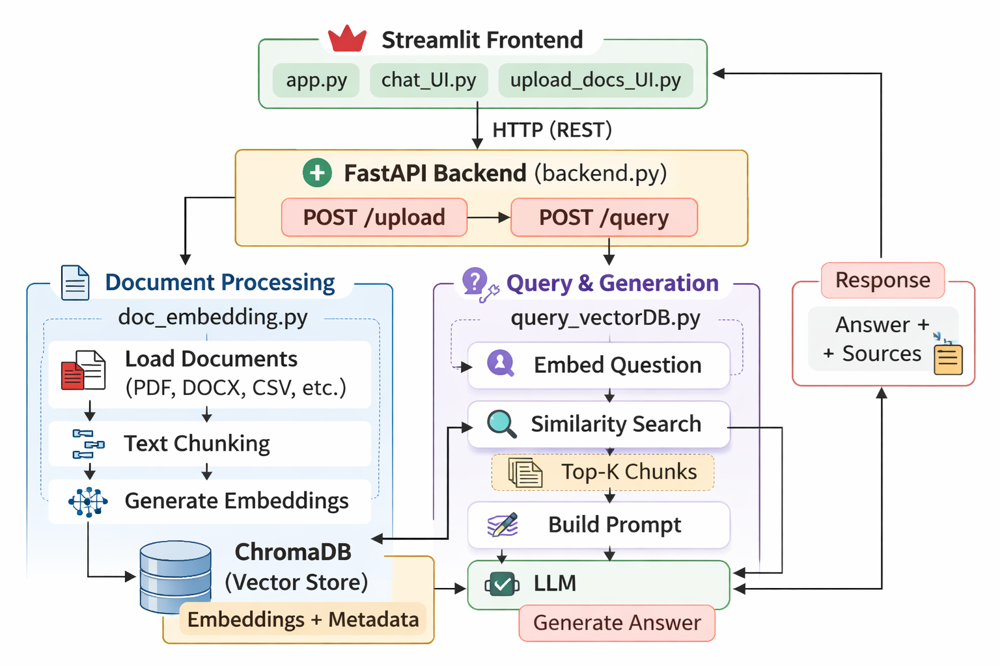
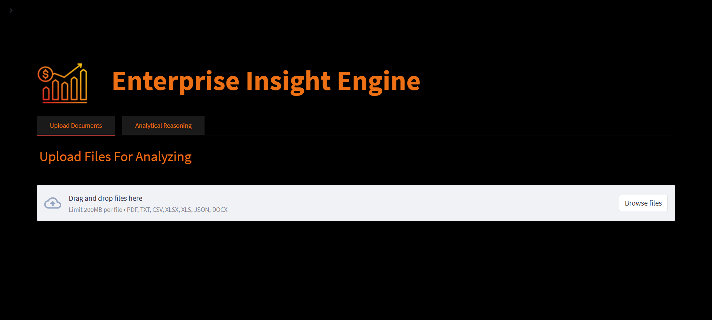
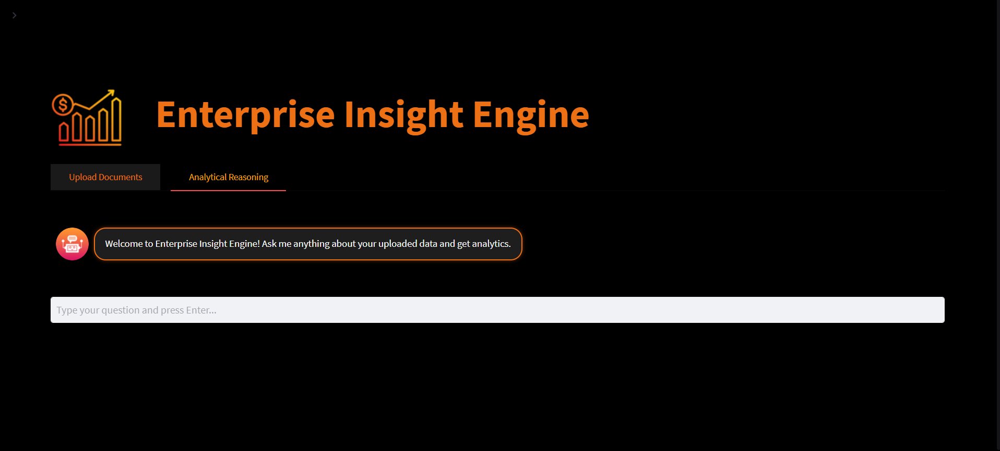
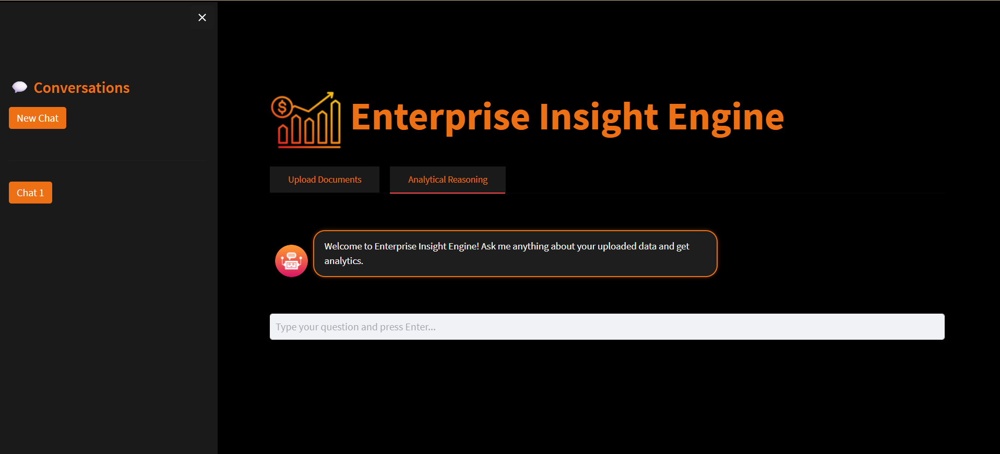
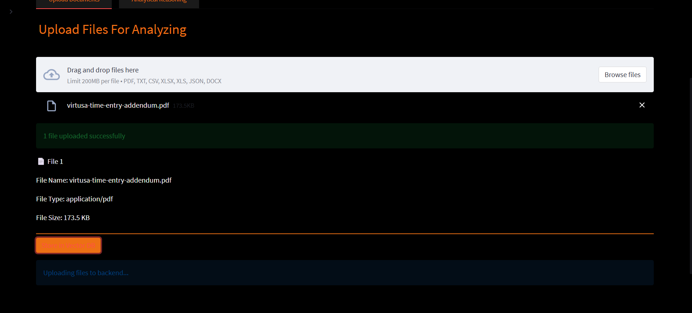
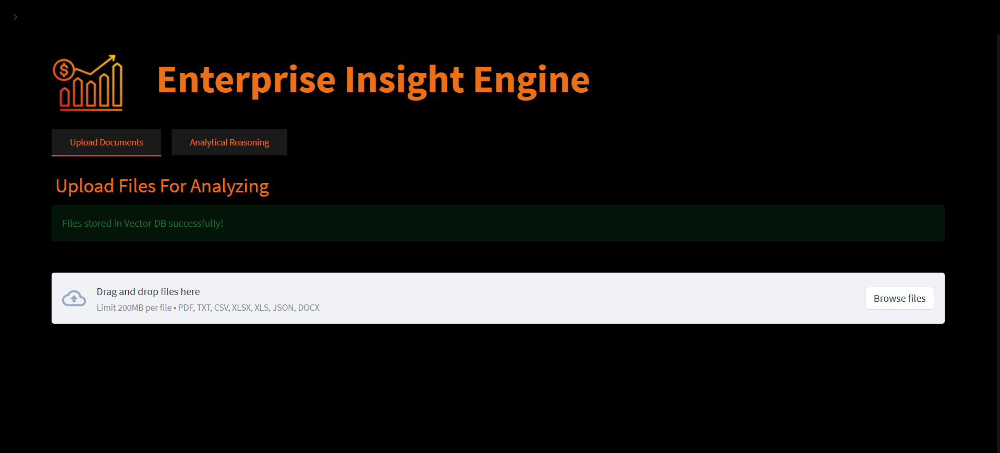
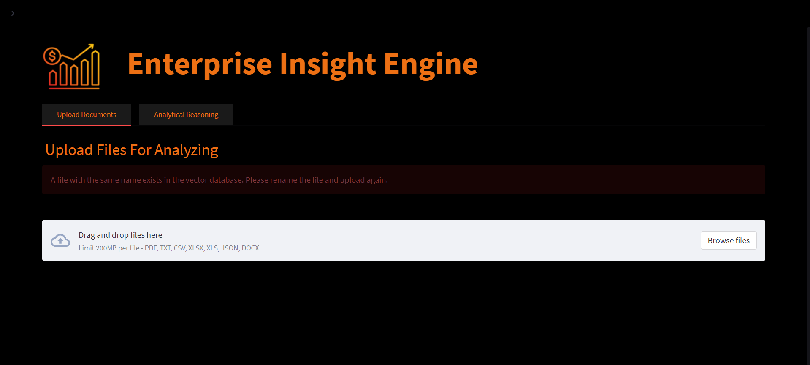
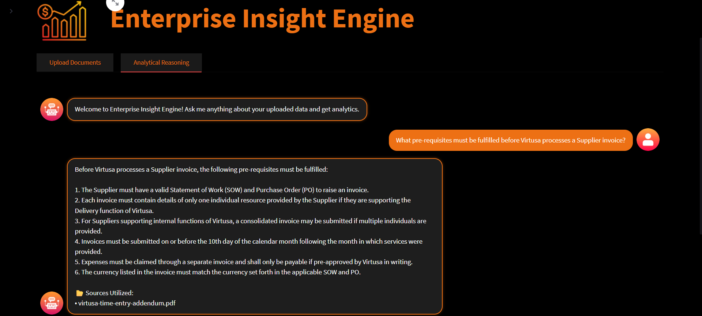
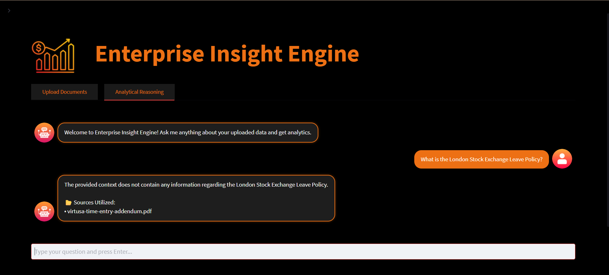
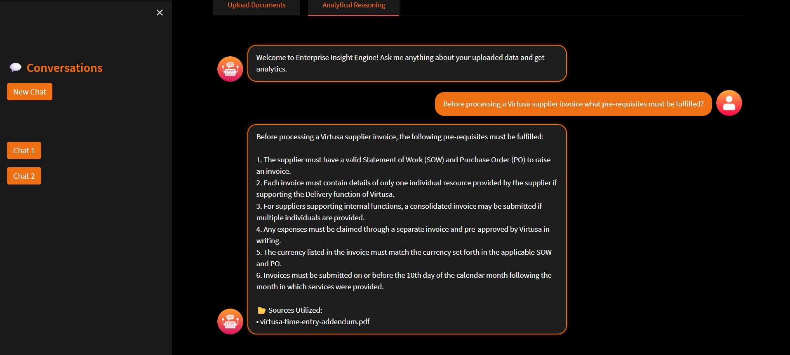

# Enterprise Insight Engine

Enterprise Insight Engine is a document-driven analytical reasoning system that enables users to:

- Upload enterprise documents (PDF, DOCX, CSV, XLSX, TXT, JSON)
- Store them into a vector database (ChromaDB)
- Ask questions via a chat interface
- Retrieve answers generated using a local LLM, only in retrieved document context

This project uses:
- **Streamlit** (Frontend UI)
- **FastAPI** (Backend API)
- **ChromaDB** (Vector Store)
- **OpenAI Embeddings** (`OpenAIEmbeddings()`)
- **LLM Inference** (`gpt-4o-mini`)

---

## 1) Overview

The system follows a Retrieval-Augmented Generation (RAG) workflow:

1. User uploads documents.
2. Documents are chunked and embedded.
3. Embeddings are stored in ChromaDB.
4. User asks a question.
5. Question is embedded and matched against stored chunks using vector similarity comparison.
6. Top chunks are passed into the LLM as context.
7. LLM generates an answer using only that context.

This ensures answers are based on uploaded enterprise documents instead of random model knowledge of the LLM.

---

## 2) Architecture

### High-Level Architecture Diagram




## 3) Components Breakdown

### Streamlit Frontend
- `app.py`  
  Controls page layout, tabs, styling, and app title.

- `upload_docs_UI.py`  
  Handles uploading documents to backend via `/upload`.

- `chat_UI.py`  
  Provides chat interface, stores conversation history in session state, sends queries to `/query`.

---

### FastAPI Backend
- `backend.py`
  Provides 2 endpoints:
  - `POST /upload` → processes and stores documents in vector DB

  - `POST /query` → performs retrieval + LLM generation

---

### Vector + RAG Logic
- `doc_embedding.py`
  Loads documents, chunks them, generates embeddings, stores them in ChromaDB.

- `query_vectorDB.py`
  Embeds user's question, retrieves top chunks from ChromaDB using similarity search, builds a prompt, generates response with local LLM and retrieve the formattted response.

---

## 4) Model Choices

## Embedding Model: OpenAIEmbeddings
Chosen because:
- Used for vector representation of documents and queries
- Good semantic similarity performance
- Easy integration with LangChain

## LLM Model: gpt-4o-mini
Chosen because:
- Cost-effective
- Fast inference
- Strong contextual reasoning
- Suitable for enterprise analytics tasks

### Vector Database: ChromaDB
Chosen because:
- Simple local persistence
- No need for external cloud services
- Fast similarity search
- Works well with LangChain

---

## 5) Setup Instructions

### Step 1: Clone Repository

```bash
git clone <repo_url>
cd <your_project_folder>
```

---

### Step 2: Create Virtual Environment (This is the Recommended Approach) Or Run in the Global Python Environment

#### Windows

```bash
python -m venv venv
venv\Scripts\activate
```

#### Mac/Linux

```bash
python3 -m venv venv
source venv/bin/activate
```

---

### Step 3: Install Dependencies

```bash
pip install -r requirements.txt
```

---

### Step 4: Environment Variables (.env)

Create a `.env` file in the project root:

```env
OPENAI_API_KEY= <your_openai_api_key>
CHROMA_DB_PATH = Chroma
SIMILARITY_SEARCH_INDEX = 5
SIMILARITY_MARGIN_VALUE = 0.7
```

### Meaning

* `OPENAI_API_KEY` : The Open AI Api Key
* `CHROMA_DB_PATH`: Folder where Chroma stores vectors
* `SIMILARITY_SEARCH_INDEX`: Number of top retrieved results
* `SIMILARITY_MARGIN_VALUE`: Minimum relevance score allowed

Change the CHROMA_DB_PATH, SIMILARITY_SEARCH_INDEX, SIMILARITY_MARGIN_VALUE accordingly for your requiremnets and to have a high data accuracy and integrity.

If you don't have an OpenAI API key, visit:  
https://openai.com/api/

---

## 6) How to Run the App

You are required to run **backend** and **frontend** in two terminals.

---

### Terminal 1: Start FastAPI Backend

```bash
uvicorn cd App
```

```bash
uvicorn backend:app --reload --port 8000
```

Backend runs at:

```
http://127.0.0.1:8000
```

---

### Terminal 2: Start Streamlit Frontend

```bash
streamlit cd App
```

```bash
streamlit run app.py
```

Frontend runs at:

```
http://localhost:8501
```

---


## 7) Application Overview

### Application Screenshots

#### Uploading Documents User Interface



#### Data Querying User Interface



#### Side Chat Pane UI



### Application Test Cases - Usability

#### Uploading Documents - Success Scenario





#### Uploading Documents - Failed Scenario



#### Query Data - Query Related Data



#### Query Data - Query Unrelated Data



### Application Test Cases - Consistency

#### Query Data - Type 1 Question


#### Query Data - Type 2 Question



## 8) Assumptions

This system is built based on these assumptions:

1. Users upload enterprise documents containing useful text content.
2. Uploaded documents are safe and trusted as no malware scanning implemented.
3. The vector DB is local and is in the machine running the backend.
4. Document processing is done when a documents is uploaded.
5. Chat history is only valid for a given session and not permanently. 
6. One user is using the system at a time. 

---

## 9) Limitations

This RAG implmentation and the integrated sysytem currently has the following limitations:

#### Local Vector DB only
  Data is stored in a local vector DB and needs to change when scailling this prototype to enterprise level. 

#### No Document Deletion
  Once a document is embedded into ChromaDB, there is no feature to delete it.

#### Duplicate Detection Based Only on File Name
  Duplicate checking is done only by file name.
  If the same file is uploaded with a different name, it will be stored again.

#### Chat History is Not Stored Permanently Across Multiple Sessions
  Streamlit session state stores conversations per browser session.
  If multiple users use it or if the same user refreshes the session, chat history will be reloaded.

#### No Authentication or User Level Data Isolation
  No authentocation mechanism is implemented in the system to authenticate users. 

#### No Conversation Memory Sent to LLM
  Each time when the LLM is queried with a question the process begins from start as no conversation memory is sent to the LLM. 

---

## 10) Future Improvements

1. Implement user authentication.
2. Migrate from local ChromaDB to a scalable cloud based vector database.
3. Add document deletion and update functionality.
4. Implement content based duplicate detection.
5. Store chat history in a permanent database.
6. Implement metadata based filtering for document retrieval.
7. Add document-level access control and user-based data isolation.
8. Implement LLM token usage tracking and cost monitoring.